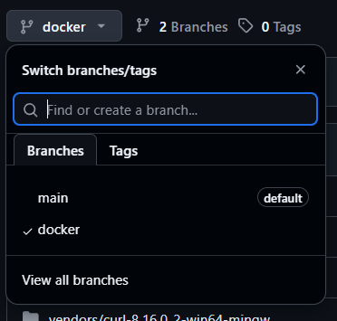
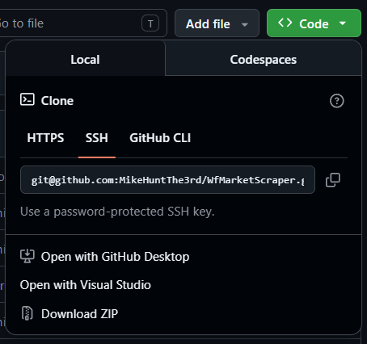

# WfMarketScraper

## Table of Contents

- [Overview](#overview)
- [Setup](#setup)
  - [Standalone Build](#standalone-build)
  - [Docker](#docker)
- [Usage](#usage)
  - [Basic Usage](#basic-usage)
  - [Settings](#settings)
- [Contributing](#contributing)
- [License](#license)

---

## Overview

This tool is half scraper, half trade manager.

It sifts through [Warframe Market's](https://warframe.market/) public API and finds trade pairs that when bought and sold result in a net platinum gain.
It also manages trades made in-game by reading Warframe's `EE.log` file.

> **Note:** This tool is not illicit. As far as the author is aware, it does not break any rules imposed by Warframe or Warframe Market — it never exceeds the 3 requests-per-second API rate limit and does not manipulate any game files.

---

## Setup

There are 2 main options for building this project if you don't want to download a pre-built binary from Releases.

### Standalone Build

Build from source. The following dependencies are required:

- git
- mingw or gcc
- cmake
- make or ninja
- curl (Linux only)

Make sure all of these are installed and available on your PATH before continuing.

#### Steps

1. **Clone the repo**

   Use the SSH URL if you're on Linux.
   ```bash
   git clone https://github.com/MikeHuntThe3rd/WfMarketScraper.git
   ```

2. **Generate build files with CMake**

   Enter the `build` folder and run the following. Omit `-G Ninja` to generate for Make instead.
   ```bash
   cmake -G Ninja ..
   ```

3. **Compile**

   Still in `build`, run the appropriate command for your build system. The compiled executable will be in `build/bin`.
   ```bash
   ninja
   ```

#### Final Remarks

It's recommended to add `root/build/bin` to your environment variables so you can invoke the tool from any terminal.

---

### Docker

To build with Docker you only need [Docker](https://docs.docker.com/get-started/get-docker/) and optionally git.

#### Steps

1. **Clone or download the repo**

   With git:
   ```bash
   git clone -b docker https://github.com/MikeHuntThe3rd/WfMarketScraper.git
   ```
   Or download it manually:
   - Select the `docker` branch

     

   - Then download the archive

     

2. **Edit `docker-compose.yml`**

   Docker needs to know where your `EE.log` file lives. Open `docker-compose.yml` and replace the placeholder with the absolute path to that file on your machine:
   ```bash
   - replace_this_with_absolute_path_to_your_EE.log_file:/app/data/EE.log:ro
   ```

3. **Build and run**

   From the project root, build the image:
   ```bash
   docker build -t scraper .
   ```
   Then run it:
   ```bash
   docker compose run scraper
   ```

#### Final Remarks

Similarly to the standalone build, the `docker-compose.yml` file is a local component. Setting a terminal alias that runs it from its directory is a convenient way to make it globally accessible.

---

## Usage

There are 2 major components to this tool, exposed under the `run` and `set` subcommands.

### Basic Usage

Under `scraper run` you have 5 different ways to run the tool.

An optional `-j / --jwt` flag can be passed anywhere after `run` to set your JWT temporarily. **When this option is used, the JWT will not be saved.**

Every `scraper run` option requires a JWT — either saved in settings or passed as a parameter. Only the base `scraper run` and `scraper run local` options additionally require `ee_path` to be set.

#### Example

```bash
scraper run web --jwt copy_pasted_jwt_string
```

Output after a moment:
```bash
[Attention] using JWT from cli — it will not be saved anywhere
[Attention] current balance: 100
[Success] found good trade for: blind_rage
[Post] adding: blind_rage
```

---

### Settings

Under `scraper set` you have several options to customize the tool's behaviour.

The most important variables to configure before first use:

- `jwt` — Your personal token for Warframe Market. Find it by opening [warframe.market](https://warframe.market/) in your browser, pressing `F12`, navigating to the Storage tab, and copying the JWT value.
- `ee_path` — The absolute path to your `EE.log` file. On Windows the tool can usually detect this automatically; if it can't, you'll need to locate the file manually.
- `plat` — Your current platinum balance. Set it once and run at least the `local` component after each trade to keep it managed automatically.

Each variable also has `--show` and `--reset` attributes. Multiple variables can be set in a single command.

#### Example

```bash
scraper set plat -s margin 10 vt --reset
```

Output:
```bash
[Data] plat value: 100
[Attention] setting: margin to: 10
[Attention] resetting: vt
```

---

## Contributing

When you encounter unexpected behaviour or an outright bug, check the [issues page](https://github.com/MikeHuntThe3rd/WfMarketScraper/issues) first — your problem may already be tracked. If not, feel free to open a new issue and it will be addressed as soon as possible.

For improvements or new features, pull requests are welcome at any time.

---

## License

This project depends on the following libraries:

- [CLI11](https://github.com/CLIUtils/CLI11) — BSD 3-Clause
- [nlohmann/json](https://github.com/nlohmann/json) — MIT
- [curl](https://curl.se) — curl license (MIT derivative)

This project itself is licensed under the [GNU General Public License v3.0](https://www.gnu.org/licenses/gpl-3.0.en.html).
